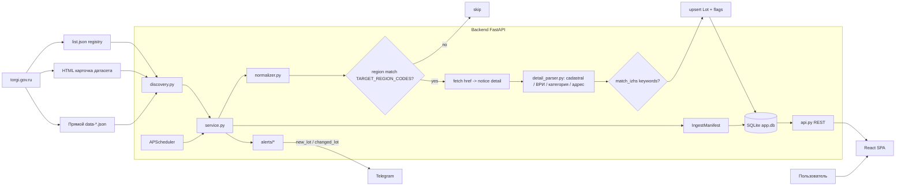

# AGENTS.md - Контекст проекта для AI-агентов

> **Если ты AI-агент, прочитай это перед работой.**
>
> 1. Этот файл - постоянный контекст: описание проекта, архитектура, команды, соглашения. Меняется редко.
> 2. Хронологический журнал работ - в [WORKLOG.md](WORKLOG.md). Прочитай минимум последние 1-3 записи, чтобы знать, что делалось недавно.
> 3. После завершения работы **обязательно дополни WORKLOG.md** новой записью (шаблон в конце WORKLOG).
> 4. Если ты сделал структурное изменение (новая зависимость, новый сервис/страница, новая команда, изменение архитектуры) - обнови соответствующий раздел AGENTS.md.

---

## 1. Что это за проект

**Название:** ГИС Торги Monitor (MVP).

**Бизнес-цель:** автоматический мониторинг новых и изменяющихся аукционов по земельным участкам под ИЖС (приоритетно - Тюмень и Тюменская область), первичная оценка рыночной стоимости по аналогам и расчёт инвестиционной привлекательности лота. Сократить ручное время на поиск и первичный анализ, выявлять интересные участки с дисконтом к рыночной цене.

**Источники данных:**
- ГИС Торги (`torgi.gov.ru`) - основной государственный реестр лотов **(подключён)**.
- НСПД (`nspd.gov.ru`) - кадастр и пространственные данные **(не подключён, в roadmap)**.
- Циан, Авито, Домклик - рыночные аналоги **(не подключены, в roadmap)**.

**Текущая стадия:** рабочий MVP в dev-режиме на SQLite. Реализован ingest ГИС Торги с фильтрацией по региону и обогащением кадастровыми полями из деталей извещений. Фокус на ИЖС-лотах. PostgreSQL, НСПД, Циан, оценка по аналогам, инвестиционный скоринг - в roadmap.

---

## 2. Технологический стек

**Backend (`backend/`):**
- Python 3.11+
- FastAPI 0.115 ([backend/app/main.py](backend/app/main.py), [backend/app/api.py](backend/app/api.py))
- SQLAlchemy 2.0 ORM ([backend/app/models.py](backend/app/models.py), [backend/app/database.py](backend/app/database.py))
- Alembic 1.13 миграции ([backend/alembic/versions](backend/alembic/versions))
- APScheduler 3.10 - планировщик ingest ([backend/app/scheduler.py](backend/app/scheduler.py))
- httpx 0.27 - HTTP клиент
- pydantic-settings 2.5 - конфиг из `.env` ([backend/app/config.py](backend/app/config.py))
- jsonschema 4.23 - валидация structure-*.json
- БД: SQLite в dev (`data/app.db`), PostgreSQL в плане
- pytest 8.3 - тесты ([backend/tests](backend/tests))

**Frontend (`frontend/`):**
- React 18 + TypeScript 5
- Vite 8 (билд и dev-сервер)
- react-router-dom 7 - роутинг
- maplibre-gl 5 - карта (стиль `https://demotiles.maplibre.org/style.json`)

**Инфраструктура:**
- docker-compose для локального запуска с PostgreSQL ([docker-compose.yml](docker-compose.yml)) - в текущем dev-режиме не используется, ждёт миграции на PG.

---

## 3. Структура репозитория

```
backend/
  app/
    main.py            # FastAPI app, CORS, startup-хуки, авто-create_all
    api.py             # все REST-эндпоинты (/api/lots пагинация+CSV export, /api/lots/facets, /api/lots/{id}, /api/lots-map, /api/ingest-runs, /api/opendata-notices пагинация, /api/opendata-notices/facets)
    models.py          # SQLAlchemy: Organizer, Lot, LotSnapshot, IngestRun, IngestManifest, AlertEvent, OpenDataNotice
    schemas.py         # Pydantic-схемы ответов API
    config.py          # Settings (pydantic-settings, читает корневой .env)
    database.py        # engine, SessionLocal, get_db
    scheduler.py       # APScheduler + scheduled_ingest()
    services/
      ingest/
        client.py            # fetch_json_payload[_with_meta], save_raw_payload
        discovery.py         # 3-уровневый discovery (registry/card/direct), watermark, backfill
        normalizer.py        # normalize_lot() - две формы: opendata-notice и обычный лот
        detail_parser.py     # defensive parser: cadastral_number / area_sqm / land_category / permitted_use / address + match_izhs()
        service.py           # run_ingest() - оркестратор + region-фильтр + detail-fetch + idempotency
      alerts/
        service.py     # notify_lot_event - дедупликация по AlertEvent
        telegram.py    # send_telegram_message
  alembic/
    env.py
    versions/          # 5 миграций: init, opendata_notices, ingest_manifest, lot_land_fields, lot↔opendata_notice link
  scripts/
    fetch_latest_opendata.py        # ручная выгрузка свежего data-*.json
    verify_detail_parser_real.py    # верификация detail_parser (online через --data-url, offline через --data-file/--reanalyze; сегментированный coverage)
    verify_detail_parser_window.py  # пакетная верификация на окне дат (online + --from-local-files + --reanalyze-existing)
    import_opendata_to_db.py        # импорт data-*.json + structure-*.json в opendata_notices
    run_backfill_ingest.py          # backfill за интервал дат
    reprocess_lots_offline.py       # офлайн-репроцессинг существующих Lot: пересчёт is_izhs_candidate + добор кадастра из LotSnapshot.payload
    link_lots_to_notices.py         # backfill Lot.opendata_notice_id по существующим парам href/reg_num
    repair_poisoned_ingest_manifests.py  # ingest_manifest: processed+0 при error-envelope или при несоответствии (живой URL непустой, в БД 0 записей)
    dev_sync_schema.py              # dev-only: ALTER TABLE для существующей SQLite под новые поля моделей
  tests/                            # pytest (api, ingest client/discovery/service/upsert, normalizer, detail_parser, retry, notice-link)
  requirements.txt
  alembic.ini
  Dockerfile

frontend/
  src/
    main.tsx           # точка входа, BrowserRouter
    App.tsx            # <Routes>: /, /notices, /lots, /lots/:id, /map, /ingest
    api.ts             # fetch-обёртки + buildLotsExportUrl; fetchLots → LotListPage, fetchNotices → NoticeListPage
    types.ts           # Notice, NoticeListPage, Lot, LotListPage, LotDetail, MapPoint, IngestRun
    facetFilterUi.ts   # порог числа значений фасетов для одиночного `<select>` vs свободный ввод
    styles.css         # CSS-переменные + классы layout/table/badge/card
    vite-env.d.ts
    components/
      Layout.tsx        # шапка + nav + <Outlet/>
      StatusBadge.tsx   # цветной бейдж статуса
      FacetMultiPicker.tsx  # мультивыбор фасетов: кнопка, панель с чекбоксами, Применить
      LotsTable.tsx
      TradesTable.tsx
      TradesMap.tsx     # MapLibre, авто-fitBounds для нескольких точек, flyTo для одной
    pages/
      DashboardPage.tsx     # /
      TradesPage.tsx        # /notices
      LotsPage.tsx          # /lots
      LotDetailPage.tsx     # /lots/:id
      MapPage.tsx           # /map
      IngestRunsPage.tsx    # /ingest
  package.json
  tsconfig.json
  vite.config.ts
  Dockerfile

data/
  app.db               # SQLite dev-БД (gitignored)
  raw/                 # сырые data-*.json и structure-*.json для ручного импорта

.env                   # реальные значения (НЕ редактировать без явной просьбы)
.env.example           # шаблон
docker-compose.yml
README.md
AGENTS.md              # этот файл
WORKLOG.md             # журнал работ
```

---

## 4. Архитектура



**Ключевые инварианты:**

- Идемпотентность: `IngestManifest(source_url, sha256)` уникальна, повторно тот же файл не обрабатывается ([backend/app/services/ingest/service.py](backend/app/services/ingest/service.py) - `_is_manifest_processed`).
- Watermark: в `operational` режиме старт = `max(IngestManifest.data_to)` для провайдера/датасета.
- Schema versioning: только `SUPPORTED_STRUCTURE_VERSIONS` (по умолчанию `20240401`) обрабатываются; остальные сохраняются в raw и помечаются `schema_migration_required`.
- Операционный ingest: план файлов — только окно watermark от последнего `data_to` (без полного слияния с историческим списком из реестра), иначе сортировка начиналась бы с самых старых срезов.
- На старте backend при `RUN_INGEST_ON_STARTUP=true` и пустом `ingest_runs` запускается один operational ingest (`@app.on_event("startup")` в [backend/app/main.py](backend/app/main.py)). По умолчанию в [backend/app/config.py](backend/app/config.py) флаг `false`; в [.env.example](.env.example) для локального dev указано `true`. Долго висящие `IngestRun` в `running` закрываются при старте как прерванные.

---

## 5. Команды разработки

**Запуск (Windows PowerShell):**

```powershell
# Backend
cd backend
python -m uvicorn app.main:app --reload --host 0.0.0.0 --port 8000

# Frontend (в отдельном терминале)
cd frontend
npm run dev
```

После запуска:
- API: http://localhost:8000
- SPA: http://localhost:5173
- Healthcheck: GET http://localhost:8000/health

**Сборка / проверки:**

```powershell
# Frontend type-check
cd frontend
npx tsc --noEmit

# Frontend production build
cd frontend
npm run build

# Backend tests
cd backend
pytest
```

**Alembic (готовится к prod, в dev обычно не нужно):**

```powershell
cd backend
alembic revision --autogenerate -m "describe change"
alembic upgrade head
alembic current
```

**Backfill за интервал:**

```powershell
cd backend
python scripts/run_backfill_ingest.py --from-date 2026-04-01 --to-date 2026-04-10
```

**Починка ingest_manifest после ошибочного «processed» на теле `{"error":...}` от Торгов:**

```powershell
cd backend
python scripts/repair_poisoned_ingest_manifests.py
```

---

## 6. Соглашения для агентов

**Язык:**
- UI, пользовательские сообщения, текст в WORKLOG.md и AGENTS.md - на русском.
- Имена символов в коде, имена файлов и директорий - английские (snake_case в Python, camelCase в TS).
- Комментарии в коде - английские, кратко и по делу. Не дублировать то, что и так читается.

**Стиль:**
- Эмодзи **не использовать** ни в коде, ни в UI, ни в этих документах.
- Не добавлять очевидные комментарии («increment counter», «return result»).
- Следовать форматированию существующих файлов рядом.

**Безопасность и осторожность:**
- Не делать `git commit` без явной просьбы пользователя.
- Не редактировать `.env` (там реальные значения). При необходимости менять `.env.example`.
- Не пушить ничего в remote и не делать force-операции без явной просьбы.

**Технические правила:**
- В dev-режиме `Base.metadata.create_all()` в [backend/app/main.py](backend/app/main.py) - сознательный компромисс. При изменении моделей в [backend/app/models.py](backend/app/models.py) **обязательно** создавать Alembic-ревизию **И** запускать [backend/scripts/dev_sync_schema.py](backend/scripts/dev_sync_schema.py), потому что `create_all()` не делает ALTER на уже существующих таблицах.
- При изменении API синхронизировать [frontend/src/types.ts](frontend/src/types.ts) и [frontend/src/api.ts](frontend/src/api.ts).
- Новые зависимости фронта - через `npm install <pkg>` в `frontend/`, бекенда - правкой [backend/requirements.txt](backend/requirements.txt) с фиксированной версией.
- Карта (`maplibre-gl`) тяжёлая - бандл около 1.2 МБ. При оптимизации использовать динамический импорт `MapPage`.

**Рабочий процесс:**
1. Прочитать AGENTS.md (этот файл) и [WORKLOG.md](WORKLOG.md) - минимум 1-3 свежих записи.
2. Выполнить задачу.
3. Проверить: `npx tsc --noEmit` и/или `pytest`, в зависимости от что трогали.
4. Дописать запись в [WORKLOG.md](WORKLOG.md) сверху (шаблон в конце WORKLOG).
5. Если сделано структурное изменение - обновить соответствующий раздел AGENTS.md.

---

## 7. Текущий статус

**Работает:**
- Ingestion pipeline: 3-уровневый discovery, watermark, backfill, идемпотентность, schema-versioning - [backend/app/services/ingest/](backend/app/services/ingest).
- **Региональный фильтр** (`TARGET_REGION_CODES`, например `72,86,89`) и **обогащение деталями notice** (cadastral_number, area_sqm, land_category, permitted_use, address) - [backend/app/services/ingest/service.py](backend/app/services/ingest/service.py), [backend/app/services/ingest/detail_parser.py](backend/app/services/ingest/detail_parser.py).
- **Текстовые fallback'и парсера**: regex-площадь с единицами (кв.м/м²/га/сотки), ВРИ-маркеры в `lotName`/`description` (ИЖС, ЛПХ, КФХ, садоводство, огородничество), кадастр с пробелами и через `characteristics.code=CadastralNumber`.
- **Сегментированная coverage-метрика**: разрез по `is_land_plot`, `land_category`, `lot_name` в [backend/scripts/verify_detail_parser_real.py](backend/scripts/verify_detail_parser_real.py); offline-режимы `--data-file` / `--reanalyze` / `--reanalyze-existing` для VPN-on прогонов.
- **Retry detail-fetch**: один retry с backoff 1.5s в `_fetch_detail_with_retry` ([backend/app/services/ingest/service.py](backend/app/services/ingest/service.py)).
- **ИЖС-детектор** через keyword match (`IZHS_KEYWORDS`).
- **Связь Lot ↔ OpenDataNotice**: FK `Lot.opendata_notice_id`, ingest пишет обе таблицы атомарно, `/api/lots/{id}` возвращает `notice_payload` (raw opendata-извещение) - [backend/app/models.py](backend/app/models.py), [backend/app/api.py](backend/app/api.py).
- REST API: `/health`, `/api/lots` (ответ `{ items, total, limit, offset }`; фильтры; `sort`; `start_price_per_sotka` / `start_price_per_sqm` из извещения; `category` повторяющимся query для OR по видам торгов), `GET /api/export/lots.csv` (те же фильтры), `/api/lots/facets`, `/api/lots/{id}` (+ `notice_payload`, `opendata_notice_id`), `/api/lots-map`, `/api/ingest-runs`, `/api/opendata-notices` (ответ `{ items, total, limit, offset }`; фильтры `document_type` / `bidd_type_code` списками и `reg_num`), `/api/opendata-notices/facets` - [backend/app/api.py](backend/app/api.py).
- Планировщик ingest (APScheduler, по умолчанию раз в сутки) - [backend/app/scheduler.py](backend/app/scheduler.py).
- Telegram-уведомления (дедупликация через AlertEvent; опционально только ИЖС — `TELEGRAM_ALERT_ONLY_IZHS`) - [backend/app/services/alerts/](backend/app/services/alerts).
- Pytest: 45+ тестов (API + notice_payload, ingest client/discovery/service с region+detail+retry+notice-link, нормализатор, detail_parser: текстовые fallback'и + characteristic-коды площади/цены).
- SPA: страницы Dashboard / Notices (server-side пагинация по 50, фильтры document_type / bidd_type_code / reg_num) / Lots (пагинация, сортировка по ₽/сотка, CSV, регион/тип — как раньше) / LotDetail / Map / IngestRuns - [frontend/src/](frontend/src).
- TypeScript-проверка чистая, Vite production build проходит.

**Не сделано / на паузе:**
- НСПД, Циан/Авито/Домклик - не подключены (нужна сеть к этим хостам, сейчас VPN-on блокирует).
- Нет оценки рыночной стоимости и инвестиционного скоринга.
- Telegram реально не настроен (`.env` содержит пустые `TELEGRAM_BOT_TOKEN` / `TELEGRAM_CHAT_ID`).
- Нет линтеров в CI (есть минимальный workflow: pytest + tsc).
- Frontend не имеет тестов и error boundary.
- Реальный замер выигрыша coverage от текстовых fallback'ов парсера возможен только при VPN-off.
- 2941 существующих лота не слинкованы с notices (исторические записи до общей точки записи). Выровняется автоматически после нескольких live-ingest проходов.

---

## 8. Roadmap

В порядке бизнес-приоритета:

1. **Интеграция НСПД**: клиент к `nspd.gov.ru` для пространственных и кадастровых данных (геометрия участка, точная площадь, ВРИ, категория земель). Это даст надёжные данные вместо текстового парсинга.
2. **Верификация detail-parser на свежем live-окне после VPN-off**: прогнать `verify_detail_parser_window.py --days 10 --limit-per-day 80`, замерить, что текстовые fallback'и из 20260504 подняли coverage `area_sqm` / `permitted_use` / `cadastral_number` на сегменте `is_land_plot=true` (текущая офлайн-сводка: 67 / 99 / 70%).
3. **Циан**: HTTP-клиент, модель `MarketComparable`, сохранение аналогов по локации/площади/ВРИ.
4. **Оценка по аналогам**: алгоритм медианы ₽/сотка с поправками. Модель `Valuation`.
5. **Скоринг инвестиционной привлекательности**: формула `discount_to_market * liquidity * location_score - risk`. Колонка `investment_score` в API и фронте, сортировка/фильтр по нему. Возможен v0 без рынка (₽/сотка по региону/ВРИ как baseline).
6. **Smart-алерты**: пуш в Telegram только при `score >= threshold`, а не на любое изменение лота.
7. **Наблюдаемость ingest**: показывать `processed_files`, `failed_files`, последний `source_url` ошибки; различать временную недоступность источника и настоящую ошибку схемы.
8. **PostgreSQL prod-сетап**: переключить `DATABASE_URL`, отключить `create_all()`, поднять docker-compose с реальной БД, прогнать `alembic upgrade head`.
9. **CI**: расширить GitHub Actions — ruff, eslint (сейчас pytest + tsc).
10. **Frontend code-splitting** карты (`React.lazy` для `MapPage`), error boundary.
11. **Авито/Домклик** как дополнительные источники аналогов.

Закрыто в 2026-05-04: пункт «Объединить `lots` ↔ `opendata_notices`» (FK + общий ingest-путь + UI-блок «Сырое извещение»).
Закрыто в 2026-05-05: пункт «Server-side пагинация `/api/opendata-notices`» (ответ `{ items, total, limit, offset }` + UI-пагинация Notices).
